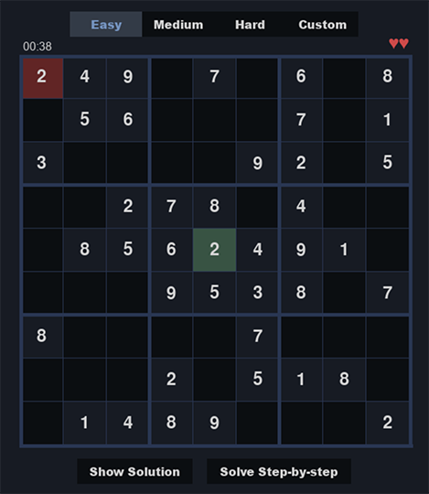
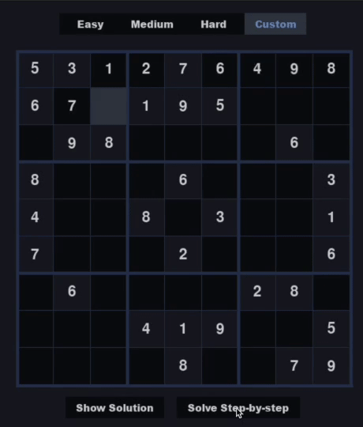

# Pydoku - Python Sudoku GUI
A Pygame implementation of Sudoku that can generate random boards for you to play and solve existing ones.

## Installation
Clone the repository:
```bash
git clone https://github.com/lengvietcuong/pydoku.git
```
Install requirements using
```bash
pip install -r requirements.txt
```

## Usage
Run `main.py`.

Use the arrow keys (`←` `↑` `→` `↓`) or your mouse to move to the desired square.

Press the key from `1` to `9` corresponding to the number you want to put.

Press `Delete`/`Backspace` to remove a number.

To play on random boards, choose `Easy`, `Medium`, or `Hard`. (guaranteed to be valid with a unique solution)



To solve an existing board, choose `Custom`.

If your custom board has multiple solutions, the number of solutions will be displayed and you can use the left and right arrow keys (`←` `→`) to cycle between them.

To reveal the solution instantly, press `Show Solution`.

To visualize the backtracking algorithm used, press `Solve Step-by-step`.

